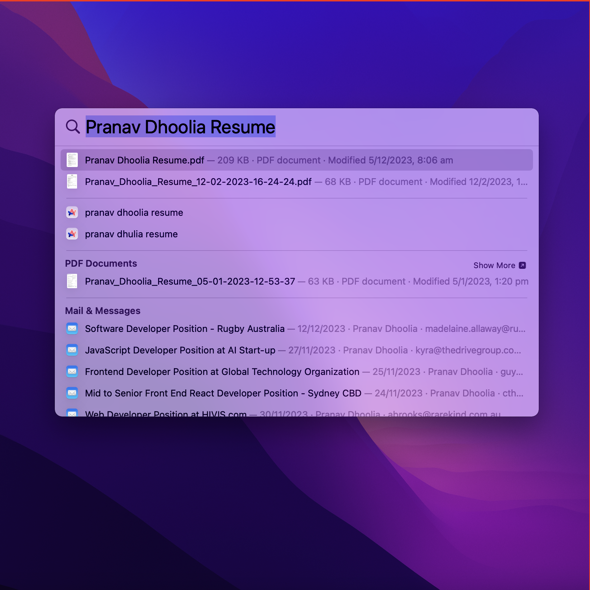
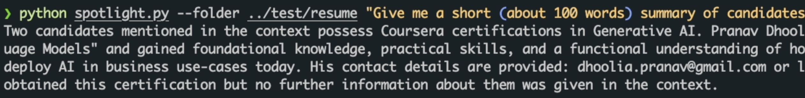
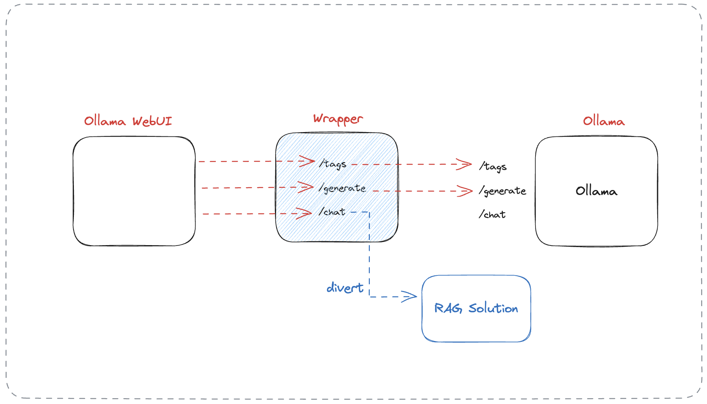
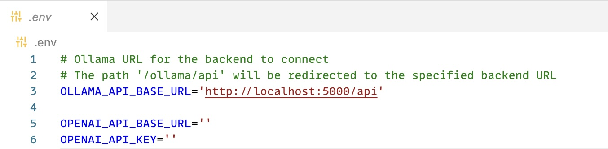
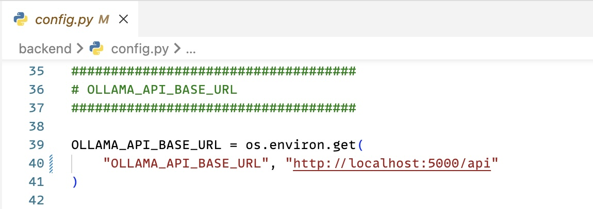
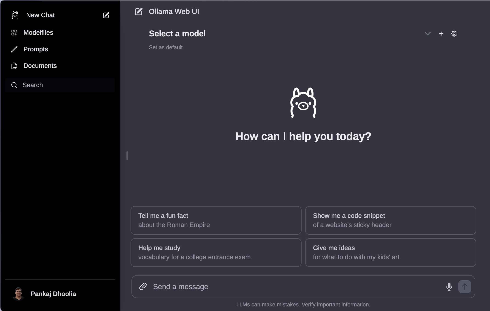
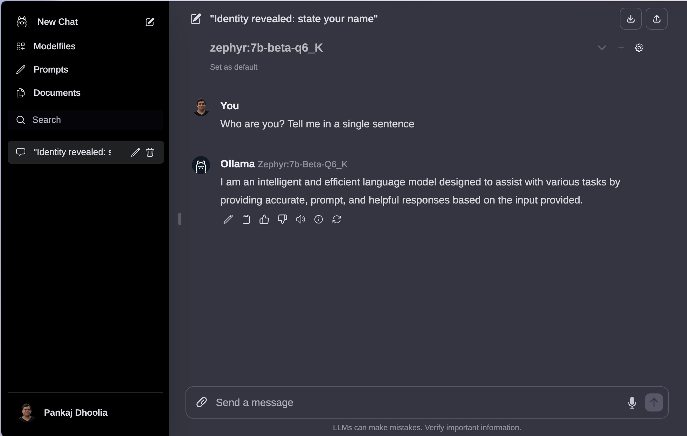
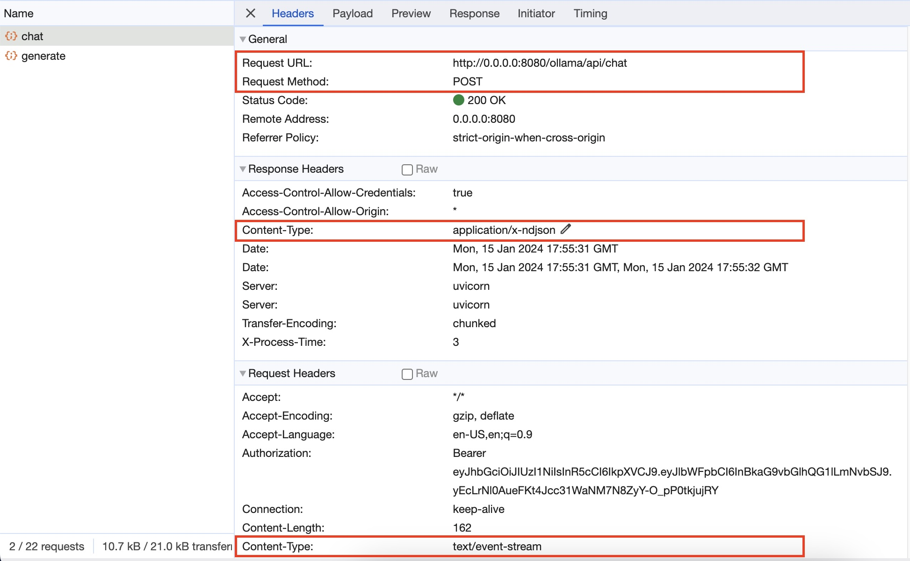
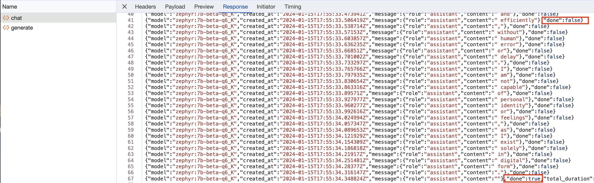
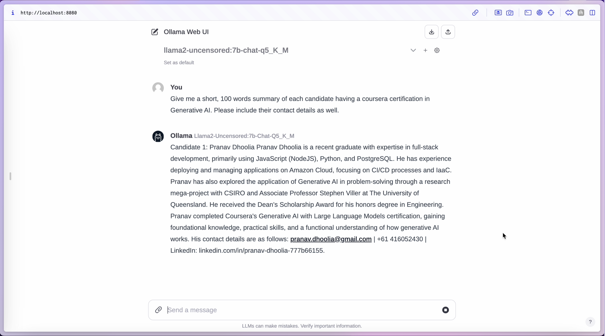

# Repurposing Ollama WebUI for your Custom RAG Projects

Create a Generic Chat UI that we can use with ANY LLM solution we create in future!

In a [previous blog](https://esxr.io/local-llm-rag-solution-ollama-spotlight-langchain), we learnt how to extend the MacOS Spotlight search and build a smart solution on top of it that answers our questions by using the filesystem as a database.



We tested it on resumes stored in a folder to only retrieve resumes matching a specific criteria. However, the only way we could interact with such a system was through a commandline interface. Not exactly the dream!



We want our solution to look somewhat like that of ChatGPT! As we saw in the first video, Ollama WebUI offers a very similar user experience. However, Ollama WebUI has primarily been designed to allow interactions with raw, out-of-the-box LLMs. Our motivation here is to use Ollama WebUI as the UI for our custom local RAG solution. **So let's get started!**

The code to the repo is provided here:

[https://github.com/esxr/local_llms_rag_solution](https://github.com/esxr/local_llms_rag_solution)

Our intuition here is that Ollama web UI expects certain API end-points to be available to interact with Ollama's API, i.e., the chat, generate, list, ... etc. The main API being the `chat` which is invoked when we send a message. So if can provide the same API, and wrap it around our custom solution, we should be able to use Ollama WebUI for our user experience. And that's exactly what we pursue in this video.



If you haven't seen the [previous blog](https://esxr.io/local-llm-rag-solution-ollama-spotlight-langchain) or watched [the videos](https://youtu.be/7S73a_XuTdg), its recommended to watch them because this is an extension of that.

## Setup

Let's start by setting up the environment. To build our wrapper API we will use FastAPI. We will make pass-thru requests to Ollama's API for all the other end-points that we don't want to handle.

```zsh
conda create -n gen_ui python=3.11
conda activate gen_ui
pip install fastapi uvicorn httpx
```

## Let's build & configure Ollama WebUI

```sh
git clone https://github.com/ollama-webui/ollama-webui.git
cd ollama-webui/

# Copying required .env file
cp -RPp example.env .env
```

Let's now configure the `.env` file. We want our wrapper API to sit in middle of Ollama Web UI and Ollama. So we'll modify the configuration here to point to our wrapper API instead of Ollama's API.



Let's now build the Ollama WebUI frontend.

```sh
# Building Frontend Using Node
npm i
npm run build
```

Let's now install the Ollama WebUI backend dependencies.

```sh
cd ./backend
pip install -r requirements.txt -U
```

Let's configure the backend to use our wrapper API instead.



Let's now serve Ollama WebUI backend.

```sh
# Serving Frontend with the Backend
sh start.sh
```

## Pass-thru Wrapper

Let's now start with wrapper API. Let's begin by writing a pass-thru wrapper first. FastAPI extends the startlette library, which provides us with base middleware classes. We'll use the `BaseHTTPMiddleware` to intercept all client requests coming on to our server, send them to Ollama's API, and return the response to the client. We'll add this middleware to the FastAPI application. We'll use `uvicorn` to run our FastAPI application on port 5000.

```python
# main.py
import asyncio
import json
from datetime import datetime

import httpx
from fastapi import FastAPI, Request
from fastapi.responses import StreamingResponse
from starlette.middleware.base import BaseHTTPMiddleware
from starlette.responses import Response

app = FastAPI()
OLLAMA_SERVER_URL = "http://localhost:11434"

class RelayMiddleware(BaseHTTPMiddleware):
    async def dispatch(self, request: Request, call_next):
        other_server_url = f'{OLLAMA_SERVER_URL}{request.url.path}'

        body = b""
        async for chunk in request.stream():
            body += chunk

        async with httpx.AsyncClient() as client:
            req_data = {
                "method": request.method,
                "url": other_server_url,
                "headers": request.headers.raw,
                "params": request.query_params,
                "content": body
            }

            response = await client.request(**req_data)
            return Response(response.content, status_code=response.status_code, headers=dict(response.headers))

# Add the middleware to the FastAPI application
app.add_middleware(RelayMiddleware)

if __name__ == "__main__":
    import uvicorn
    uvicorn.run(app, host="0.0.0.0", port=5000, log_level="info")
```

Let's do a quick test of our wrapper. Make sure to have Ollama running on port 11434.

1. Go to the dashboard at: http://localhost:8080. You should see the dashboard without any errors.

   

2. Now select the model you want and chat. You should see the chat working as expected.

   

Great! So our pass-thru wrapper is working as expected.

## Customizing `/api/chat`

Let's now override the `/api/chat` in our wrapper. Let's begin by excluding `/api/chat` from the pass-thru wrapper. We'll do this by adding a condition in the middleware to exclude `/api/chat` from the pass-thru wrapper.

```python
...
class RelayMiddleware(BaseHTTPMiddleware):
    async def dispatch(self, request: Request, call_next):
        # Check if the request is for the /api/chat route
        if request.url.path == "/api/chat":
            # If so, just call the next item in the middleware stack
            return await call_next(request)

        # Otherwise, handle the request as before
        ...
```

Before we customize the `/api/chat` endpoint, Let's do a quick network analysis of Ollama WebUI to see what it expects from the `/api/chat` endpoint.

We find that:

1. The `/api/chat` is a `POST` request with a `text/event-stream` content-type, and a `application/x-ndjson` response.

   

2. The request body is a JSON object with the following structure:

   ```json
   {
     "model": "<model_name>",
     "messages": [
       {
         "role": "<user|assistant>",
         "content": "<text>"
       }
     ]
   }
   ```

   

3. The response is a `application/x-ndjson` stream. With each message having line having the following structure:

   ```json
   {
       "model": "<model_name>",
       "created_at": "<datetime.utc.isoformat()>",
       "message": {"role": "assistant", "content": "<text>"},
       "done": <False|True> // True for the last message
   }
   ```

   

We learnt that the `chat` endpoint is a streaming endpoint. We read the input as an **event-stream**, and we'll format the dummy output to the **Newline delimited JSON** (`application/x-ndjson`) format. NDJSON is a convenient format for storing or streaming structured data that may be processed one record at a time. Each line in an NDJSON file is a valid JSON value, but the entire file is not a valid JSON array. This format is particularly useful for streaming LLM outputs. Ollama uses it as well.

Let's now customize the `/api/chat` endpoint to first push some dummy response. To begin with the processing logic is just a placeholder, and pretty much echoes back the request content.

```python
...
@app.post("/api/chat")
async def chat(request: Request):
    def process(input_data):
        # Process the input_data and return a string
        # This is a placeholder for actual processing logic
        processed_string = "Processed: " + str(input_data)
        return processed_string

    async def generate_ndjson(model: str, msg: str):
        for word in msg.split():
            yield json.dumps({
                "model": model,
                "created_at": datetime.utcnow().isoformat() + "Z",
                "message": {
                    "role": "assistant",
                    "content": word + " "
                },
                "done": False
            }) + "\n"
            await asyncio.sleep(0.1)
        yield json.dumps({
            "model": model,
            "created_at": datetime.utcnow().isoformat() + "Z",
            "message": {"role": "assistant", "content": "."},
            "done": True
        }) + "\n"

    # initialize input
    input_string = ""
    # Extract input from Ollama WebUI request (MIME type: text/event-stream)
    async for bytes in request.stream():
        if bytes:
            input_string = bytes.decode()
        else:
            continue
    # Process input_data
    input_data = json.loads(input_string)
    output = process(input_data)

    # Stream output in Ollama WebUI desired format (MIME type: application/x-ndjson)
    return StreamingResponse(generate_ndjson(model=input_data["model"], msg=output), media_type="application/x-ndjson")
...
```

Let's now test our customized `/api/chat` endpoint.


Voila, our dummy echo based response is working as expected.

## Wrap `/api/chat` around our RAG solution

Let's now modify the chat API to invoke our RAG solution. But before that, we'll need to modify our RAG solution. If you can recall from the [repo](https://github.com/esxr/local_llms_rag_solution), the code to our `main` function looks somewhat like this:

```python
...
def main():
    # Setup argument parser
    parser = argparse.ArgumentParser(description="Search files using Spotlight.")
    parser.add_argument("--folder", type=str, help="Folder to search in", default=None)
    parser.add_argument("query", type=str, help="Search query")

    # Parse commandline arguments
    args = parser.parse_args()

    # Create search query
    keywords = extract_keywords(args.query)
    query = " OR ".join(keywords)

    # Perform spotlight search
    search_results = search_with_spotlight(query, folder=args.folder)

    # Generate answer for the original query and top 3 search results
    print(
        generate_answer(
            args.query,
            search_results[:3],
            doc_type="Candidate"
        )
    )

if __name__ == "__main__":  # Entry point of the program
    main()
...
```

Let's modify this code a bit so that it can be used with other programs as well. Our final code should look somewhat like this

```python
def chat(query, folder=None):
    # Let's extact keywords from the query
    keywords = extract_keywords(query)

    # Construct an OR query from the keywords
    search_query = " OR ".join(keywords)

    # Perform spotlight search
    search_results = search_with_spotlight(search_query, folder=folder)

    # Generate answer for the original query and top 3 search results
    print(generate_answer(query, search_results[:3], doc_type="Candidate"))

    # Print search results
    print(search_results)


if __name__ == "__main__":  # Entry point of the program
    # Setup argument parser
    parser = argparse.ArgumentParser(description='Search files using Spotlight.')
    parser.add_argument('--folder', type=str, help='Folder to search in', default=None)
    parser.add_argument('query', type=str, help='Search query')

    # Parse commandline arguments
    args = parser.parse_args()

    chat(args.query, args.folder)
```

Note that we've changed the function signature, and simplified it, so that we're left with this signature

```python
...
def chat(query, folder=None):
...
```

We can now import and plug this function anywhere we want to invoke the LLM-powered search.

let's go back to our `main.py`` file for this project, and change the process function like so, replacing

```python
def process(input_data):
        ...
        processed_string = "Processed: " + str(input_data)
        return processed_string
```

with this

```python
def process(input_data):
        ...
        processed_string = chat(
            input_data["messages"][-2]["content"],
            folder=["~/Documents/Resumes/"]
        )
        return processed_string
```

That's it! That's all that was required to link our RAG solution to the API endpoint. We can now test the solution to see if it works.



Works like a charm!

## Conclusion

In this blog, we have successfully designed a rapid and efficient approach to provide a user interface for all future projects, utilizing an existing open-source project (Ollama WebUI) as a foundation. Additionally, we have gained substantial insights into streaming APIs, a commonly utilized element in the realm of generative AI and LLMs.

We have also explored the API structure required by the Ollama WebUI and developed a wrapper for Ollama. This wrapper intercepts requests intended for Ollama and redirects them to the appropriate endpoints in our solution, seamlessly integrating with the Ollama framework.
